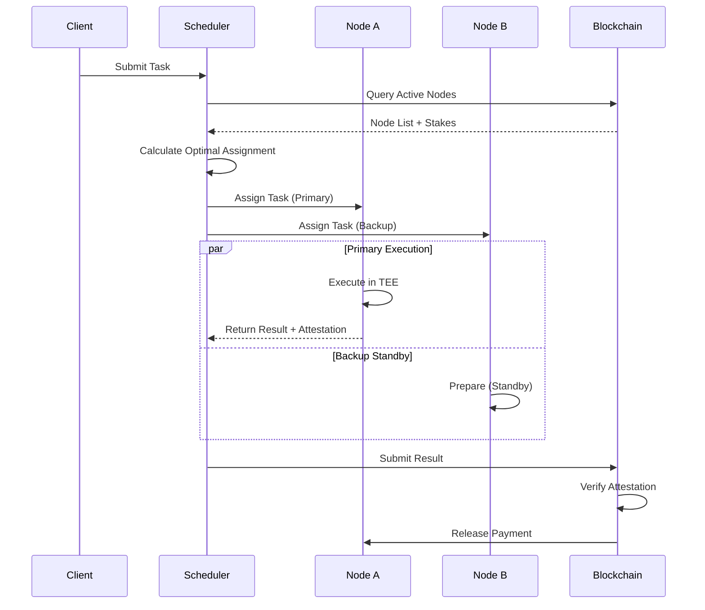

# Synapse Consensus Mechanism

## Overview

Synapse employs a novel hybrid consensus mechanism called **Proof-of-Compute-Stake (PoCS)** that combines the security of economic staking with the utility of verifiable computation work.

## Core Principles

### 1. Dual-Stake System

Every compute node must stake both:
- **SYN Tokens:** Economic collateral (slashed for misbehavior)
- **Reputation Score:** Built over time through successful task completion

### 2. Work Verification

Three-tier verification system:

```
Tier 1: TEE Attestation (Hardware-level)
   ↓
Tier 2: zk-Proof Verification (Cryptographic)
   ↓
Tier 3: Result Sampling (Statistical)
```

## Consensus Flow

### Task Assignment



### Validation Mechanism

**For Standard Tasks:**
1. TEE generates attestation report
2. Attestation verified on-chain
3. Result hash committed to blockchain
4. Payment released upon verification

**For High-Value Tasks (>$1000):**
1. Multiple nodes execute same task
2. Results compared (consensus threshold: 2/3)
3. Discrepancies trigger investigation
4. Fraudulent nodes slashed

## Slashing Conditions

| Violation | Penalty | Evidence Required |
|-----------|---------|-------------------|
| Failed TEE attestation | 10% of stake | Invalid attestation report |
| Timeout (no response) | 1% + task refund | Missed deadline proof |
| Incorrect result | 25% of stake | Fraud proof from verifier |
| Downtime (>4 hours) | 0.1%/hour | Heartbeat failure logs |
| Malicious behavior | 100% of stake | Multi-sig governance vote |

## Reward Distribution

### Epoch-Based Rewards

Rewards distributed every 6 hours (epoch):

```
Total Epoch Rewards = Inflation Rate + Task Fees

Node Reward = Base Reward + Performance Bonus + Uptime Bonus

Where:
  Base Reward = (Node Stake / Total Stake) * Epoch Rewards * 0.6
  Performance = (Tasks Completed / Total Tasks) * Epoch Rewards * 0.3
  Uptime = (Node Uptime / Epoch Duration) * Epoch Rewards * 0.1
```

### Inflation Schedule

| Year | Annual Inflation | Total Supply |
|------|-----------------|--------------|
| 1 | 8% | 108M SYN |
| 2 | 6% | 114.5M SYN |
| 3 | 4% | 119M SYN |
| 4+ | 2% | Asymptotic |

## Security Model

### Economic Security

**Attack Cost Analysis:**

To compromise the network (control >33% of compute power):

```
Minimum Attack Cost = 0.33 * Total Staked * SYN Price

Current (example):
  Total Staked = 100M SYN
  SYN Price = $1.50
  Attack Cost = 0.33 * 100M * $1.50 = $49.5M
```

### Game Theory Incentives

**Honest Node Incentive:**
- Consistent rewards from task completion
- Reputation growth → higher task priority
- Stake remains secure

**Dishonest Node Penalty:**
- Immediate slashing (10-100%)
- Reputation reset
- 30-day exclusion from network

## Federated Consensus (Advanced)

For distributed training tasks requiring multiple nodes:

### Federated Learning Consensus

```
1. Coordinator distributes model shards
2. Each node trains on local data
3. Nodes submit gradient updates
4. Byzantine Fault Tolerant (BFT) aggregation
5. Updated model distributed
6. Consensus on model improvement
```

**BFT Tolerance:** Up to f faulty nodes in a committee of 3f+1 nodes

## Upgrade Mechanism

### Soft Forks
- Parameter changes (rewards, timeouts)
- Governance vote required (51% threshold)
- 7-day implementation delay

### Hard Forks
- Protocol-level changes
- 67% supermajority required
- 30-day notice period
- Automatic migration for stakers

## Monitoring Consensus Health

### Health Metrics

```python
consensus_health = {
    'participation_rate': active_nodes / total_nodes,
    'finality_time': avg_time_to_confirmation,
    'slash_rate': slashes_per_epoch / total_nodes,
    'stake_distribution': gini_coefficient(stake_amounts),
    'geographic_diversity': entropy(node_locations)
}
```

### Alert Thresholds

| Metric | Warning | Critical |
|--------|---------|----------|
| Participation Rate | <85% | <70% |
| Finality Time | >5 min | >10 min |
| Slash Rate | >1%/day | >5%/day |
| Stake Concentration | Gini >0.6 | Gini >0.8 |

---

*For implementation details, see the smart contract source code in `/contracts/consensus/`*
